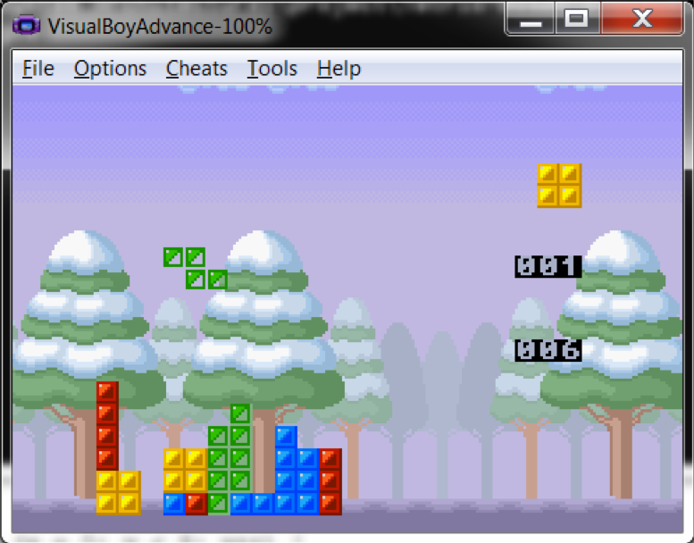

# Tetris game for Nintendo Gameboy Advance
Project for learning the system architecture of Gameboy Advance console

## Implementation  
- Mode 4 – Bitmap background  
- Sprite and 1D mapping  
  - 32 x 32 shapes (19 sprites)  
  - Moving  
  - Rotating  
- DMA copy  
- Interrupt handle  
  - Time: game speed  
- Keys handle  

## Demo  
- Board: 11x18  
- A, Up: rotate right  
- B: rotate left  
- Left: move left  
- Right: move right  
- Down: move down  
- Start: Pause/Resume  
- +30 score to up level (faster)  

